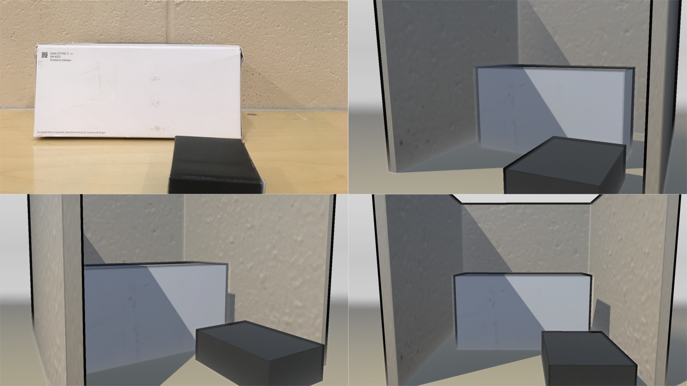
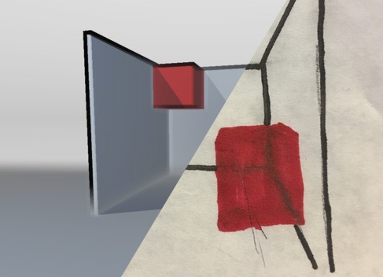

Metropolis
==

Draw a 2d sketch of a 3d room. Then, snap a picture, and in seconds, experience your creation in full 3d through the power of virtual reality and inverse graphics.

YHack 2016. Devpost: https://devpost.com/software/metropolis

## Examples

#### 3D model from picture of real life blocks

#### 3D model from 2D sketch

